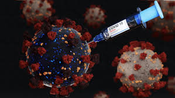

# Harvard-University-Data-Science-Capstone-Project-Covid19.analytics

It has been 2+ years that the Covid-19 pandemic has put our life and behaviors in check. This project uses the Covid-19 dataset maintained.For starting the virus is “peculiar” as not all the infected individuals experience the same symptoms. Some individuals display symptoms that are similar to the ones of a common cold or flu while other individuals experience serious symptoms that can cause death or hospitalization with different levels of severity, including staying in intensive-care units (ICU) for several weeks or even months.Elderly are the most vulnerable to the disease and reported mortality rates vary from 5 to 15% depending on the geographical location.

# Introduction:
The number of scientific papers related to CoViD19 published since the beginning of the pandemic, the amount of data and tools developed to track the evolution of pandemic. As a matter of fact, scientists are now drowning in publications related to the CoViD19, and some collaborative and community initiatives are trying to use machine learning techniques to facilitate identify and digest the most relevant sources for a given topic.
The “R Language and Environment for Statistical Computing” is not exception here. Moreover,promoting and based on the open source and open community principles, R has empowered scientists and researchers since its inception. Not surprisingly then, the R community has contributed to the official CRAN repository already with more than a dozen of packages related to the CoViD19 pandemic since the beginning of the crisis.

Here we will introduce and discuss the covid19.analytics R package.which is mainly designed and focus in an open and modular approach to provide researchers quick access to the latest reported worldwide data of the CoViD19 cases, as well as, analytically and visualization tools to process this data.

This project is related to the Choose Your Own Project Submission Project of the HarvardX: PH125.9x Data Science: Capstone course. For this project we will use different covid19 related datasets to make the latest data from the reported cases of the current CoViD19 pandemic.
